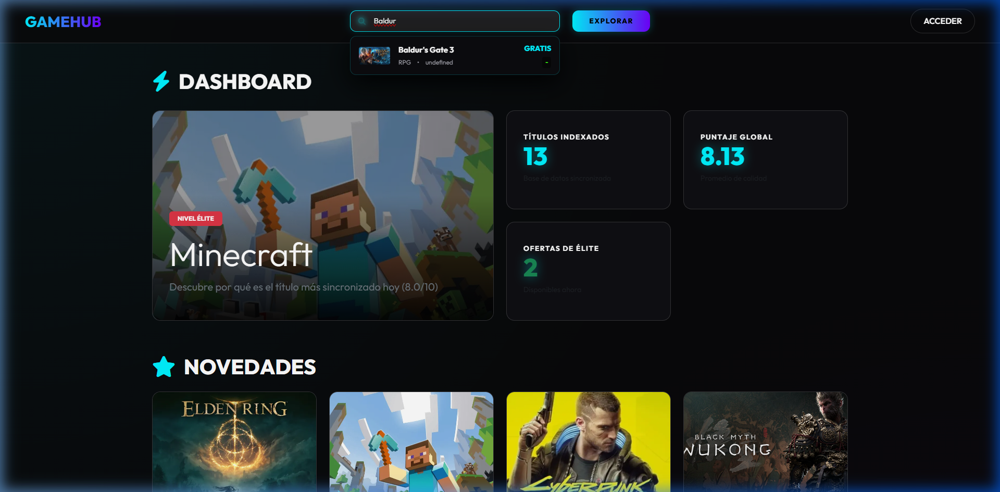
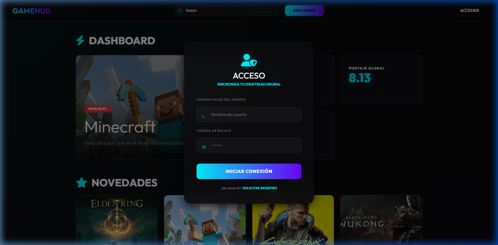

# 🎮 GameHub - Plataforma de Videojuegos Premium


GameHub es una plataforma web moderna y sofisticada diseñada para entusiastas de los videojuegos. Con una estética **Cyberpunk** y una experiencia de usuario fluida, permite explorar, buscar y gestionar tu propia colección de juegos de manera intuitiva.

## ✨ Características Principales

### 🔍 Búsqueda Avanzada y Dinámica
Encuentra exactamente lo que buscas con nuestro sistema de filtros inteligentes.
*   **Filtros multicapa:** Filtra por género, plataforma, año de lanzamiento y precio.
*   **Sugerencias en tiempo real:** Resultados dinámicos mientras escribes.
*   **Ordenamiento inteligente:** Por popularidad, fecha de lanzamiento o puntuación.



### 👤 Autenticación y Perfiles Personalizados
Sistema completo de gestión de usuarios con estética premium.
*   **Registro seguro:** Encriptación de contraseñas con Bcrypt.
*   **Tokens JWT:** Sesiones seguras y persistentes.
*   **Avatar dinámico:** Integración con DiceBear para avatares únicos.



### 📚 Biblioteca Personal (My Library)
Crea tu propia colección digital. Añade juegos a tu lista de "jugados", califícalos y deja reseñas personalizadas para compartirlas con otros usuarios.

### 🛡️ Panel de Administración y Backups
Sistema robusto para administradores que permite:
*   Gestión total del catálogo de juegos.
*   **Exportación SQL automática:** Sincronización del estado de la base de datos a un archivo físico en tiempo real para máxima seguridad de los datos.

---

## 🚀 Tecnologías Utilizadas

| Capa | Tecnologías |
| :--- | :--- |
| **Frontend** | HTML5, CSS3 (Vanilla), JavaScript Moderno (ES6+) |
| **Backend** | Node.js, Express (Arquitectura Hexagonal & SOLID) |
| **Base de Datos** | MySQL |
| **Testing** | Jest, Supertest |
| **Seguridad** | JSON Web Tokens (JWT), BcryptJS |

---

## 🛠️ Instalación y Configuración

Sigue estos pasos para poner en marcha el proyecto localmente:

### 1. Requisitos Previos
*   Node.js instalado.
*   Servidor MySQL corriendo.

### 2. Clonar y Configurar
```bash
git clone https://github.com/333marci/videojuegos_web.git
cd videojuegos_web/backend
npm install
```

### 3. Variables de Entorno
Crea un archivo `.env` en la carpeta `/backend` con los siguientes datos:
```env
PORT=8000
DB_HOST=localhost
DB_USER=tu_usuario
DB_PASSWORD=tu_contrasena
DB_NAME=videojuegos_db
JWT_SECRET=tu_clave_secreta
```

### 4. Base de Datos
Importa el archivo `database.sql` en tu servidor MySQL para inicializar las tablas y los datos de prueba.

### 5. Ejecución
El servidor sirve directamente el frontend desde la carpeta `/frontend`. Iniciarlo es tan fácil como:

```bash
# Modo desarrollo (con auto-reload):
npm run dev

# Modo producción:
npm start
```
El proyecto completo (Frontend y API) estará disponible en `http://localhost:8000`.

### 6. Testing (Pruebas Unitarias)
El backend está diseñado bajo la **Arquitectura Hexagonal** (Ports & Adapters) y principios **SOLID**, lo que permite un testeo riguroso de la lógica de negocio aislando por completo la base de datos MySQL (por inyección de dependencias).

Para correr los tests unitarios:
```bash
npm test
```
*Esto ejecutará la suite de Jest asegurando que los casos de uso funcionan perfectamente.*

---

## 🌿 Gestión de Versiones

Este proyecto utiliza un flujo de trabajo basado en ramas para asegurar la estabilidad:
*   `main`: Rama de producción. Contiene el código estable y verificado.
*   `dev`: Rama de desarrollo. Aquí es donde se prueban las nuevas características antes de integrarlas.
*   `refactor-hexagonal`: Rama de refactorización hexagonal. Contiene el código con arquitectura hexagonal, SOLID y tests unitarios.

---

Desarrollado con ❤️ para la comunidad gamer.
